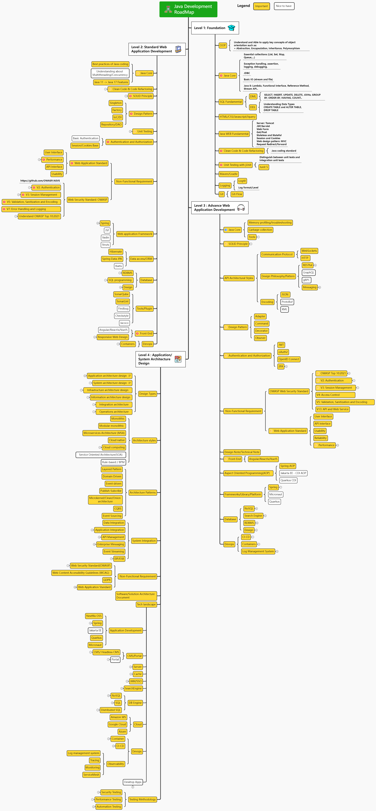

# Java Development Roadmap from Begin to Architect

## 1. The purpose of this diagram is to help you get an overview of the Java Development Roadmap. The road map helps to structure your knowledge for each level not only tech-stacks but also  quality, security, performance, architecture..

## 2. If you like this roadmap, please give it a star. Thanks!
## 3. Roadmap
